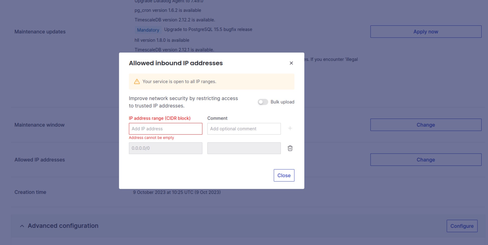

# External database setup

In this documentation you will learn how to set up the external database for
linode deployment.

We are going to use aiven.io as our external database provider. You can use any
other managed postgres provider. The steps should be similar for any other
provider. The main thing you need to do after creating a managed database is to
allow your servers to access the database. This is usually done in ip or network
configuration settings.

## Create database

Register and create a managed postgres database on [aiven](https://aiven.io). 

Once you have your postgres database up and running, you will need to copy
**Service URI** and provide it in the CLI setup when asked to enter
`DATABASE_DSN` - database connection string value. 


## Setup network access rules

You will need to make sure to deny any unknown traffic to the postgres database
and allow only traffic from the linode servers that were created during the CLI
setup.

To find the ip addresses of your servers, you can inspect `hosts.cfg` file in
the directory where you performed the CLI setup. For each server, the public ip
address is the first IP address in each line.

Let's say our `hosts.cfg` file contents look like the following:

```bash
[managers]
192.168.177.0 manager_private_ip=192.168.0.1 hostname=manager-1

[workers]
192.168.177.1 worker_private_ip=192.168.0.2 hostname=worker-01
192.168.177.2 worker_private_ip=192.168.0.3 hostname=worker-02
192.168.177.3 worker_private_ip=192.168.0.4 hostname=worker-03
192.168.177.4 worker_private_ip=192.168.0.5 hostname=worker-04

[broker]
192.168.177.5 private_ip=192.168.0.6
```

In this case our servers' public addresses are the following:
```
192.168.177.0
192.168.177.1
192.168.177.2
192.168.177.3
192.168.177.4
192.168.177.5
```

Let's add them to allowd addresses list in aiven dashboard.

When you navigate to **Allowed IP addresses** section in your aiven dashboard,
you should see something like this:



**Important!** make sure to remove the `0.0.0.0/0` record from the allowed
IPs list as this entry allows any traffic to your database.

Then, add all the public IP addresses of your linode servers to the allowed IPs
list.

